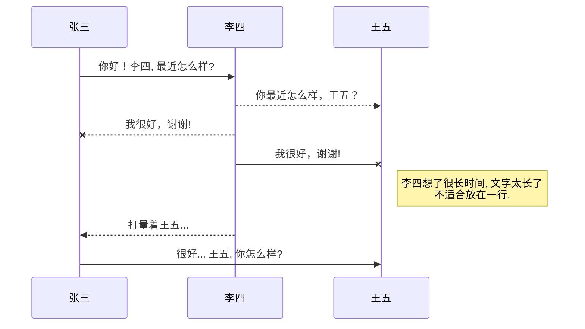
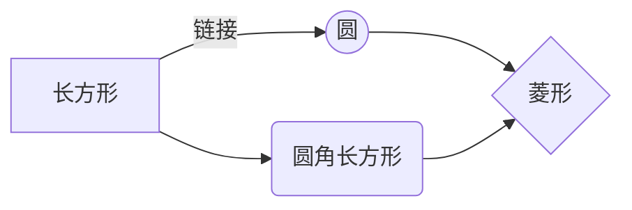
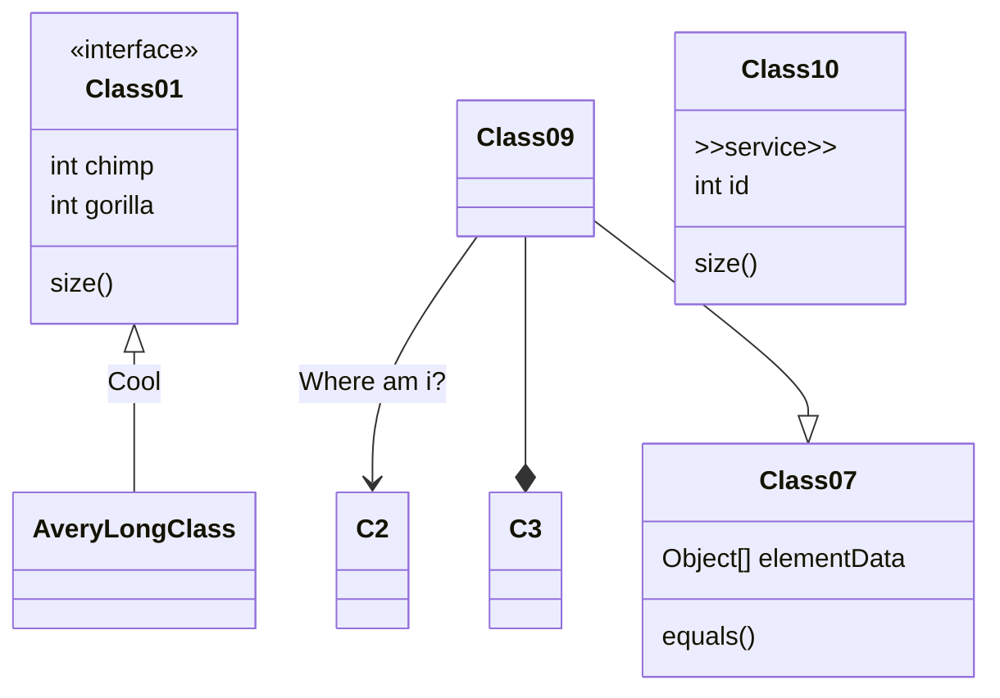

<!--
 * @Author: yuzihan yuzihanyuzihan@163.com
 * @Date: 2022-05-19 12:09:41
 * @LastEditors: yuzihan yuzihanyuzihan@163.com
 * @LastEditTime: 2022-05-19 15:48:17
 * @FilePath: /fe_interview/工具/markdown.md
 * @Description: 这是默认设置,请设置`customMade`, 打开koroFileHeader查看配置 进行设置: https://github.com/OBKoro1/koro1FileHeader/wiki/%E9%85%8D%E7%BD%AE
-->
# 快捷键
Markdown	图标	快捷键
撤销		Ctrl /⌘+Z
重做		Ctrl /⌘+Y
加粗		Ctrl /⌘+B
斜体		Ctrl /⌘+I
标题		Ctrl /⌘+Shift +H
有序列表		Ctrl /⌘+Shift +O
无序列表		Ctrl /⌘+Shift +U
待办列表		Ctrl /⌘+Shift +C
插入代码		Ctrl /⌘+Shift +K
插入链接		Ctrl /⌘+Shift +L
插入图片		Ctrl /⌘+Shift +G
查找		Ctrl /⌘+F
替换		Ctrl /⌘+G

# 标题
# 一级标题
## 二级标题
### 三级标题
#### 四级标题
##### 五级标题
###### 六级标题

# 文本样式
*强调文本* _强调文本_

**加粗文本** __加粗文本__

==标记文本==

~~删除文本~~

> 引用文本

H~2~O is是液体。

2^10^ 运算结果是 1024。

# 列表
- 项目
  * 项目
    + 项目

1. 项目1
2. 项目2
3. 项目3

- [ ] 计划任务
- [x] 完成任务

# 图片
图片: 

带尺寸的图片: 

宽度确定高度等比例的图片: 

高度确定宽度等比例的图片: 

居中的图片: 

居中并且带尺寸的图片: 

居右的图片: 

# 链接
链接: [link](https://www.csdn.net/)

# 目录
@[TOC](这里写目录标题)
# 一级目录
## 二级目录
### 三级目录

# 代码片
下面展示一些 `内联代码片`。

```
// A code block
var foo = 'bar';
```

```javascript
// An highlighted block
var foo = 'bar';
```

# 表格
项目     | Value
-------- | -----
电脑  | $1600
手机  | $12
导管  | $1

| Column 1 | Column 2      |
|:--------:| -------------:|
| centered 文本居中 | right-aligned 文本居右 |

# 注脚
一个具有注脚的文本。[^1]

[^1]: 注脚的解释

# 注释
Markdown将文本转换为 HTML。

*[HTML]:   超文本标记语言

# 自定义列表
Markdown
:  Text-to-HTML conversion tool

Authors
:  John
:  Luke

# Latex数学公式
[参考文档](https://khan.github.io/KaTeX/)
Gamma公式展示 $\Gamma(n) = (n-1)!\quad\forall
n\in\mathbb N$ 是通过 Euler integral

$$
\Gamma(z) = \int_0^\infty t^{z-1}e^{-t}dt\,.
$$

# 输入甘特图
[参考文档](https://khan.github.io/KaTeX/)
Gamma公式展示 $\Gamma(n) = (n-1)!\quad\forall
n\in\mathbb N$ 是通过 Euler integral

$$
\Gamma(z) = \int_0^\infty t^{z-1}e^{-t}dt\,.
$$

# 插入UML图
[参考文档](https://mermaid-js.github.io/mermaid/#/sequenceDiagram)


# 插入Mermaid流程图
[参考文档](https://mermaid-js.github.io/mermaid/#/flowchart?id=graph)


# 插入Flowchart流程图
[参考文档](http://flowchart.js.org/)
```mermaid
flowchat
st=>start: 开始
e=>end: 结束
op=>operation: 我的操作
cond=>condition: 确认？

st->op->cond
cond(yes)->e
cond(no)->op
```

# 插入classDiagram类图
[参考文档](https://mermaid-js.github.io/mermaid/#/classDiagram)
